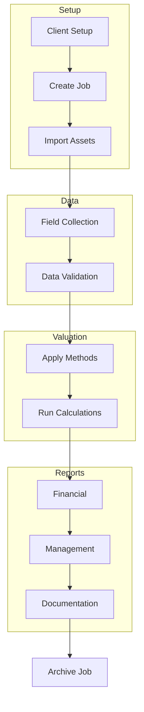
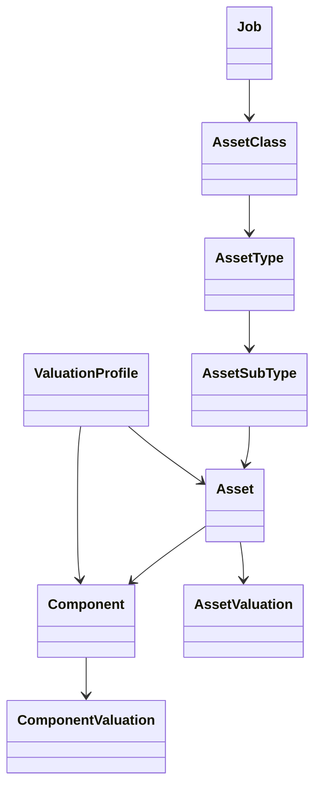

# Business–Technical Component Map

> **Note:** This documentation provides a detailed cross-reference between **business processes** and their **technical implementations** in Asset Valuer Pro (AVP). It aids developers, analysts, and auditors in understanding how each process is realized within the system.

---

## Purpose & Context

This guide bridges the gap between functional business workflows and AVP’s codebase. It helps:

* New developers understand where and how functionality is implemented
* QA teams validate functionality against process requirements
* Business analysts trace features from design to execution

AVP supports long-term, large-scale valuation projects and must:

* Isolate valuation data from live ERP/finance systems
* Support cost, market, and income valuation approaches
* Produce audit-compliant reports

---

## Valuation Method Mapping

### Market Approach

* **Business Use**: For assets with active markets (e.g., vehicles)
* **Code**: `MarketApproach.cs`, `MarketValuationMethod.cs`
* **API**: `POST /api/asset/applyMarketApproach`
* **UI**: `MarketApproachDetail.tsx`

### Income Approach

* **Business Use**: For income-generating assets (e.g., commercial buildings)
* **Code**: `IncomeApproach.cs`, `IncomeValuationMethod.cs`
* **API**: `POST /api/asset/applyIncomeApproach`
* **UI**: `IncomeApproachDetail.tsx`

### Cost Approach

* **Business Use**: For infrastructure, public works, and community assets
* **Code**:

  * Direct: `DirectCostValuationMethod.cs`
  * Apportionment: `ApportionmentCostValuationMethod.cs`
  * Historical: `HistoricalCostValuationMethod.cs`
* **API**: `POST /api/asset/recalculate`
* **UI**: `ValuationDetail.tsx`, `ValuationEditor.tsx`

---

## End-to-End Valuation Flow (Business to Code)

| Step | Business Process   | Code                                                              | Docs                           |
| ---- | ------------------ | ----------------------------------------------------------------- | ------------------------------ |
| 1    | Import Assets      | `ImportController.cs`, `ImportAssetRegisterSpreadsheetCommand.cs` | Import & Field Collection Docs |
| 2    | Define Framework   | `AssetHierarchyController.cs`, `ValuationProfileController.cs`    | Valuation Process Workflow     |
| 3    | Create Job         | `JobController.cs`                                                | Job & Process Docs             |
| 4    | Collect Field Data | `ImportController.cs`, `ContentController.cs`                     | Field Data Collection Workflow |
| 5    | Run Valuation      | `AssetController.cs`, ValuationMethod classes                     | Valuation Logic Docs           |
| 6    | Generate Reports   | `ReportsController.cs`, `*ReportQuery.cs`                         | Reporting Workflow             |
| 7    | Archive Job        | `JobController.cs`                                                | Valuation Process Workflow     |

---

## Visual Workflows & Relationships

### Asset Valuation Lifecycle

### Entity Relationship

---

## Business-to-Technical Mappings by Area

### Asset & Component Hierarchy

| Business Layer              | Entity             | Code Model        | Controller                     |
| --------------------------- | ------------------ | ----------------- | ------------------------------ |
| Asset Class                 | Top-level group    | `AssetClass.cs`   | `AssetClassController`         |
| Asset Type                  | Subgroup           | `AssetType.cs`    | `AssetClassController`         |
| Asset Sub-Type              | Detail level       | `AssetSubType.cs` | `AssetClassController`         |
| Component Name/Type/SubType | Structural details | `Component*.cs`   | `ComponentHierarchyController` |

### Valuation Setup

| Setup Area       | Code                                                     | Description                     |
| ---------------- | -------------------------------------------------------- | ------------------------------- |
| Profiles         | `ValuationProfile.cs`                                    | Links condition to depreciation |
| Assumptions      | `AssetAssumptions.cs`, `ComponentAssumptions.cs`         | Unit rates, lifecycles          |
| Replacement Cost | `AssetReplacementCost.cs`, `ComponentReplacementCost.cs` | Cost data tables                |

### Valuation Execution

| Area              | Implementation                               | Purpose                           |
| ----------------- | -------------------------------------------- | --------------------------------- |
| Method Logic      | ValuationMethod classes                      | Applies approach rules            |
| Calculation       | `RefreshJobDataService.cs`                   | Triggers valuations per job       |
| Field Integration | `ImportController.cs`, `ValuationService.cs` | Pulls synced data into valuations |

---

## Reports & Outputs

| Report Type         | Class                                                        | Output                                |
| ------------------- | ------------------------------------------------------------ | ------------------------------------- |
| General Valuation   | `GetGeneralValuationReportQuery`                             | Excel file with all valuation results |
| Insurance Valuation | `GetInsuranceValuationReportQuery`                           | Replacement + indemnity breakdown     |
| Methodology         | `GetMethodologyReportQuery`                                  | Word document explaining profiles     |
| Summary             | `GetSummaryReportQuery`                                      | Executive snapshot                    |
| Asset Management    | `GetRenewalCostReportQuery`, `GetMaintenancePlanReportQuery` | Planning data                         |

---

## Use Cases

| Role    | Use Case                                             |
| ------- | ---------------------------------------------------- |
| Dev     | Find where a business rule is implemented            |
| QA      | Test the calculation method for a valuation approach |
| Analyst | Understand how field data affects insurance values   |
| Auditor | Validate compliance between outputs and methodology  |

---

## Related Documentation

* [Valuation Process Workflow](Workflows/Valuation_Process_Workflow.md)
* [Reporting Process Workflow](Workflows/Reporting_Process_Workflow.md)
* [Field Data Collection Workflow](Workflows/Field_Data_Collection_Workflow.md)
* [Valuation Fields Dictionary](DataDictionary/Valuation_Fields_Dictionary.md)
* [Reports Inventory](Reports/Reports_Inventory.md)
