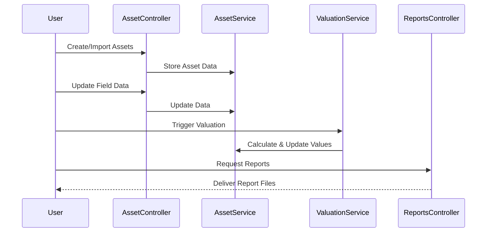
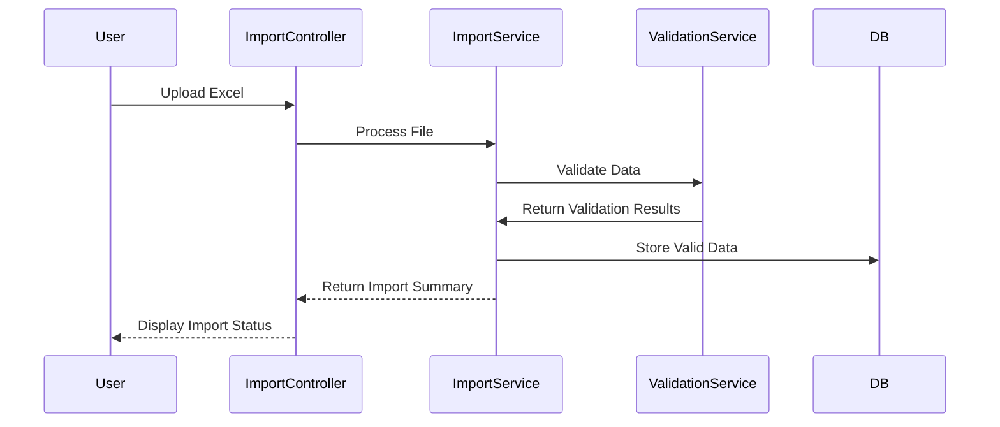

# Asset Valuer Pro: Business & Technical Overview

> **Important Note:**  
> This documentation explains the business and technical aspects of **Asset Valuer Pro (APV)**. The actual source code is maintained in a separate repository and is **not included here**.

---

## Introduction

This document provides a comprehensive overview of **Asset Valuer Pro (APV)**, bridging business needs with technical implementation. It serves as a clear orientation for both technical and non-technical audiences, especially new team members or stakeholders seeking to understand the system's purpose and design.

---

## Business Context & Objectives

APV was originally developed in the early 2010s to address complex business challenges in asset valuation and reporting, including:

- **Onboarding challenges** due to required expertise in:
  - Asset valuation methodologies
  - Accounting standards (IFRS, IPSAS)
  - Financial reporting and disclosure requirements
  - Excel and data management
  - Local government asset management regulations
- **Intellectual property leverage** by creating a **cloud-based platform** that:
  - Supports external collaborations
  - Enables wider market reach
  - Ensures data accessibility and security

APV transforms specialized, time-consuming, and error-prone manual processes into a **systematic, automated solution**.

---

## Core Business Functions of APV

APV goes far beyond simple asset valuations. It provides a suite of interconnected business functions:

### Financial Reporting Valuations
- Fully compliant with **IFRS** (International Financial Reporting Standards) and **IPSAS** (International Public Sector Accounting Standards)
- Supports year-end reporting and audit requirements

### Insurance Valuations
- Calculates **replacement values** and **indemnity values** for insured assets
- Essential for risk management and insurance planning

### Asset Management Outputs
- Lifecycle optimization modeling (**EasySAM**)
- Projected asset renewals and replacements
- Cost analysis to bring assets to satisfactory condition
- Portfolio analysis by asset condition, location, or value

### Financial Statement Disclosures
- Automated **movement reconciliations**
- Generation of valuation-related disclosure notes for financial reports
- Consolidation of data for external audits

---

## System Architecture (High-Level Overview)

The architecture follows a **modern, layered web design**, with clear separation between front-end, back-end, and data storage components:

```mermaid
graph TD
    subgraph "Frontend"
        A1[React Web App]
        A2[iOS Data Capture App (Field Collection)]
    end
    
    subgraph "Backend API"
        B1[ASP.NET Core Web API]
        B2[Controller Layer]
        B3[Service Layer]
        B4[Domain Layer]
    end
    
    subgraph "Data Storage"
        C1[Azure SQL Database]
        C2[Azure Blob Storage]
    end
    
    A1 <--> B1
    A2 <--> B1
    B1 --> B2
    B2 --> B3
    B3 --> B4
    B4 <--> C1
    B4 <--> C2
```

---

## Core Business Processes & Technical Implementations

Here’s a breakdown of key business workflows and how they’re implemented technically.

---

### 1. File Setup & Configuration
**Business**:
- Create client profiles and licenses
- Define user accounts and access roles
- Build valuation frameworks (asset hierarchies, assumptions)
- Initiate valuation jobs and register assets

**Technical**:
- `ClientController.cs`, `SubscriptionController.cs` manage client and license data
- `UserController.cs`, `RoleController.cs` handle user and role setup
- `AssetHierarchyController.cs` structures asset hierarchies
- `JobController.cs` manages valuation jobs
- `AssetController.cs`, `ImportController.cs` handle asset registration and bulk imports

---

### 2. Data Collection & Validation
**Business**:
- Field data collection using a mobile app (iOS-based or FileMaker Pro)
- Import asset data from client systems (Excel files)
- Data validation and enrichment

**Technical**:
- `ContentController.cs` handles synchronization of mobile data
- `ImportController.cs`, `ImportService.cs` manage bulk imports
- `ValidationService.cs` enforces data integrity checks

---

### 3. Valuation Calculations
**Business**:
- Valuations based on appropriate methodologies:
  - **Market approach** (for market-active assets)
  - **Income approach** (for revenue-generating assets)
  - **Cost approach** (for community or public assets)
- Generate point-in-time valuation outputs

**Technical**:
- `MarketValuationMethod.cs`, `IncomeValuationMethod.cs`, `ApportionmentCostValuationMethod.cs`, etc. implement valuation logic
- `RefreshJobDataService.cs` orchestrates the calculation workflow

---

### 4. Reporting & Outputs
**Business**:
- Generate financial and insurance valuation reports
- Produce asset management insights
- Create financial disclosures for audits and reporting

**Technical**:
- `ReportsController.cs` manages report generation
- Specialized report classes generate formatted outputs
- `BlobStorageService.cs` stores generated reports securely

---

## Business Entities & Their Technical Models

| **Business Entity** | **Technical Representation** | **Purpose** |
|---------------------|------------------------------|-------------|
| Asset | `Asset.cs` | Represents the physical asset |
| Asset Class | `AssetClass.cs` | Categorizes assets |
| Component | `Component.cs` | Defines asset components |
| Job | `Job.cs` | Represents valuation work at a point in time |
| Valuation Profile | `ValuationProfile.cs` | Stores valuation rules and parameters |

---

## Key Services Supporting Business Functions

| **Business Function** | **Service Class** | **Role** |
|-----------------------|-------------------|----------|
| Asset Import | `ImportService.cs` | Manages data import workflows |
| Valuation Calculations | `RefreshJobDataService.cs` | Coordinates asset valuations |
| Field Data Sync | `ContentService.cs` | Synchronizes mobile data |
| Reporting | `ReportService.cs` | Generates valuation reports |

---

## Key Workflows Illustrated

### Asset Valuation Workflow


### Data Import Workflow


---

## Integration with External Systems

APV operates **outside the live ERP or financial system** to maintain data integrity and auditability:

- **Point-in-time snapshots** isolate valuation data from live operational systems
- **Data import/export capabilities** support integration with external platforms
- **Quarantine measures** ensure consistent valuation results during audit cycles

---

## Technical Component Distribution

| **Functionality Area** | **Key Controllers & Services** |
|-------------------------|--------------------------------|
| Setup & Configuration | `ClientController`, `UserController`, `RoleController`, `SubscriptionController`, `AssetHierarchyController`, `ValuationProfileController` |
| Asset Management | `AssetController`, `ComponentController`, `AssetClassController`, `AssetTypeController` |
| Data Collection | `ImportController`, `ContentController`, `DocumentController` |
| Calculation & Valuation | `RefreshJobDataService`, `ValuationMethodServices` |
| Reporting | `ReportsController`, Report Generators |

---

## Next Steps for New Team Members
1️⃣ Familiarize yourself with **business workflows** from legacy documentation.  
2️⃣ Study the corresponding **codebase modules** for each business function.  
3️⃣ Use this document as a **reference** when making code changes or developing new features to ensure **alignment with business needs**.
