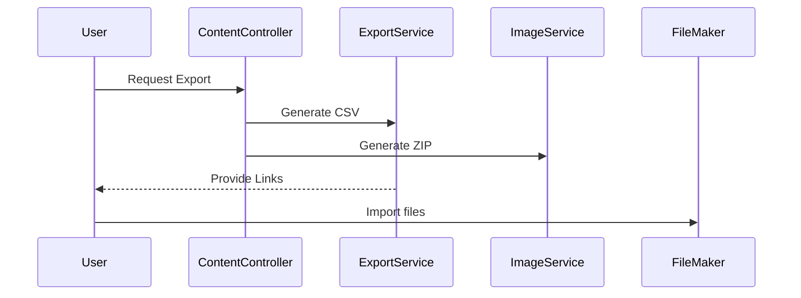
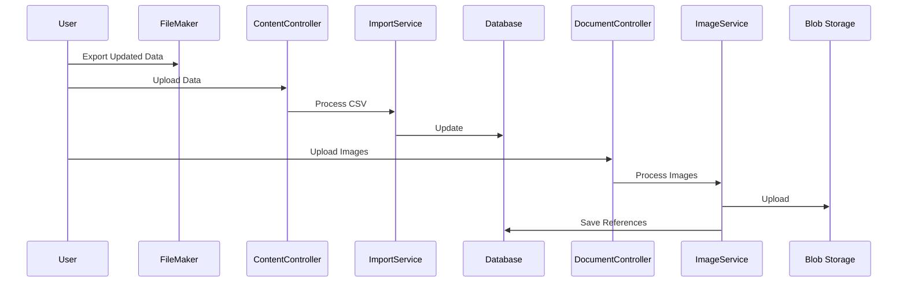

# Mobile Data Collection Technical Documentation

**Important Note:**  
This documentation describes the mobile data collection functionality. The actual source code is maintained in a separate repository and is not included here.

## Overview

This document outlines the technical implementation of mobile data collection in Asset Valuer Pro.

**Version Note:**  
The legacy documentation describes a File Maker Pro app used on iPads for field data collection. This has been replaced by the iOS-native application (version 3), which is now the only supported solution.

## Business Context

### Purpose

Field data collection is used to:

- Gather inspection data for physical assets
- Validate infrastructure details
- Capture photos and asset attributes
- Record condition scores for valuation

### Legacy Data Flow (Deprecated)

1. Export CSV data from AVP
2. Export images to ZIP
3. Import into File Maker Pro (PC)
4. Sync to iPad
5. Conduct field inspection
6. Sync data back to PC
7. Export from File Maker Pro
8. Import into AVP

## Technical Implementation

### Legacy Implementation (Deprecated)
- File Maker Pro (desktop)
- iPads for data capture
- CSV-based data exchange
- ZIP-based image handling

This approach has been phased out.

### Current Implementation (iOS App)
- React Native / Expo stack
- Native iOS features (camera, storage)
- REST API communication
- Azure Blob for images

### Integration Points

1. **ContentController.cs**
   - `/ExportFieldData`: Prepares field data
   - `/ImportFieldData`: Processes uploaded field data

2. **DocumentController.cs**
   - `/Upload`: Photo uploads
   - `/GetDocumentsByAsset`: Fetch asset documents

3. **Import/Export Services**
   - `FieldDataExportService.cs`
   - `FieldDataImportService.cs`
   - `ImageExportService.cs`
   - `ImageImportService.cs`

## Inspection Data Fields

| Category | Fields | Model |
|----------|--------|-------|
| Identification | ID, Name, Ref No. | `AssetOfflineDto.cs` |
| Location | Address, Coordinates | `AssetLocationDto.cs` |
| Physical | Dimensions, Materials | `AssetAttributesDto.cs` |
| Condition | Scores, Notes | `AssetConditionDto.cs` |
| Photos | Primary and Detail | `AssetDocumentDto.cs` |
| Inspection | Inspector, Date | `InspectionDto.cs` |

## Data Synchronization

### Export Flow

### Import Flow

## Key Technical Components

### Data Models
- `AssetOfflineDto.cs`
- `InspectionDto.cs`
- `AssetConditionDto.cs`
- `AssetDocumentDto.cs`

### Services
- `FieldDataExportService.cs`
- `FieldDataImportService.cs`
- `ValidationService.cs`
- `SyncService.cs`

### Controllers
- `ContentController.cs`
- `DocumentController.cs`

## Current Implementation Notes

**Version Note:**  
Version 3 (iOS Native) is the only supported solution. Key advantages:

- Direct backend sync via API
- Modern mobile UI
- Elimination of CSV workflow
- Improved reliability and speed

## Security Considerations

- Device authentication required
- Data encrypted in transit
- Temporary files cleaned after import
- Access restricted to authorized users
