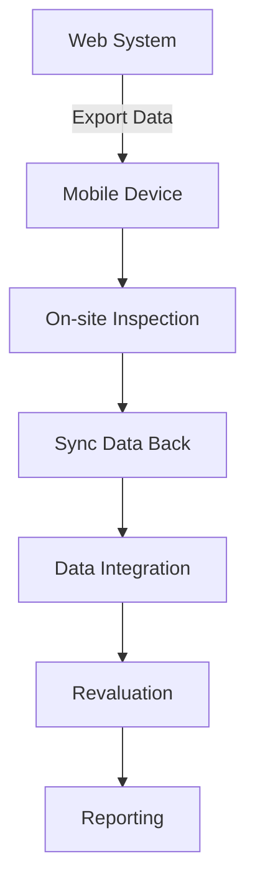

# Field Data Collection Workflow Documentation

## Overview

This document provides a complete explanation of how Asset Valuer Pro (AVP) handles **field data collection** for assets. It outlines the business purpose, mobile integration, technical process flow, and how collected data influences asset valuation and reporting.

> **Use Case:** This workflow is critical for ensuring valuation accuracy, providing photographic evidence, and enabling field-based condition assessment and planning.

---

## Key Business Steps

1. **Export data** to mobile devices for inspection
2. **Capture data** in the field (e.g., photos, dimensions, conditions)
3. **Sync data** back into AVP
4. **Integrate updates** into asset records and valuation logic

---

## End-to-End Process Flow

---

## Business Context

* Essential for buildings and physical infrastructure
* Improves data quality with visual and observed evidence
* Provides input for:

  * Remaining Useful Life
  * Maintenance planning
  * Condition-based valuation

---

## Mobile App Versions

### Version 2: File Maker Pro (Legacy)

* CSV & ZIP exports to FileMaker iPad app
* Manual sync via PC
* Limited photo & GPS integration

### Version 3: iOS App (Current)

* React Native-based iPad app
* Full offline/online capability
* Direct API sync, GPS/photo support
* Real-time sync on reconnect

---

## Technical Workflow Breakdown

### Data Export

* Export asset list and metadata for inspection
* Format: CSV (assets), ZIP (photos), JSON (references)
* Components:

  * `ExportAssetsModal.tsx`
  * `ImportController.cs`
  * API: `/api/asset/export`, `/api/asset/exportImages`

### Data Collection

* Inspectors capture:

  * Condition score (1–10 scale)
  * Asset dimensions (L, W, H, area)
  * Observations and defect notes
  * GPS-tagged photos
* Offline-capable app with:

  * Camera & GPS access
  * Local SQLite database
  * Barcode scanning

### Data Sync

* Version 2: Device → PC → Re-import via CSV/ZIP
* Version 3: Direct upload to AVP API
* APIs:

  * `/api/import/fieldData`
  * `ContentController.cs` for image upload
* Validator: `AssetFileValidator.cs`

### Integration

* Update `Asset` records:

  * Condition, dimensions, inspection status
  * Attach images and notes
* Trigger recalculation via:

  * `ValuationService.cs`
  * `RecalculateAssetCommand`
* UI components:

  * `AssetView.tsx`, `ImageViewer.tsx`

---

## Data Captured Per Asset

| Category   | Details                              |
| ---------- | ------------------------------------ |
| Dimensions | Length, width, area                  |
| Condition  | Score (1–10), observations           |
| Visuals    | Photos of asset & defects            |
| Metadata   | Inspector name, GPS, inspection date |

---

## Impact on Valuation

| Field Data      | Influence                                         |
| --------------- | ------------------------------------------------- |
| Condition Score | Used in Remaining Service Potential (RSP)         |
| Measurements    | Update replacement cost calculations              |
| Observations    | Adjust useful life / maintenance cost projections |
| Photos          | Support asset validation and audit                |

---

## Technical Architecture

| Layer    | Component                                                          |
| -------- | ------------------------------------------------------------------ |
| Mobile   | React Native iPad app, SQLite storage                              |
| Backend  | `AssetController.cs`, `ImportController.cs`, `ValuationService.cs` |
| API      | RESTful endpoints for data and image sync                          |
| Database | `AssetValuation`, `Image`, `Note` entities                         |

---

## Version Comparison

| Feature         | Version 2         | Version 3              |
| --------------- | ----------------- | ---------------------- |
| Device          | FileMaker on iPad | Custom iOS App         |
| Sync            | Manual (via PC)   | Direct API integration |
| Offline Support | Limited           | Full                   |
| Photo Handling  | External ZIP      | In-app photo with sync |
| Data Validation | Post-import       | Real-time              |

---

## Field-to-System Mapping

| Field Input  | System Target                     |
| ------------ | --------------------------------- |
| Score        | `AssetValuation.ConsumptionScore` |
| Length/Width | `Asset.Length`, `Asset.Width`     |
| Notes        | `Note.Text` per asset ID          |
| Photos       | `Image` entity linked to asset ID |

---

## Workflow Integration Points

* Revaluation trigger post sync
* Report generation updated with new values/photos
* QA workflows use inspection status

---

## Related Resources

* [Valuation Process Workflow](Valuation_Process_Workflow.md)
* [Asset Model](../Models/Asset.md)
* [Valuation Fields Dictionary](../Dictionaries/Valuation_Fields_Dictionary.md)
* [Import/Export Services](../Models/ImportExport.md)
* [Content Controller API](../API/ContentController.md)
