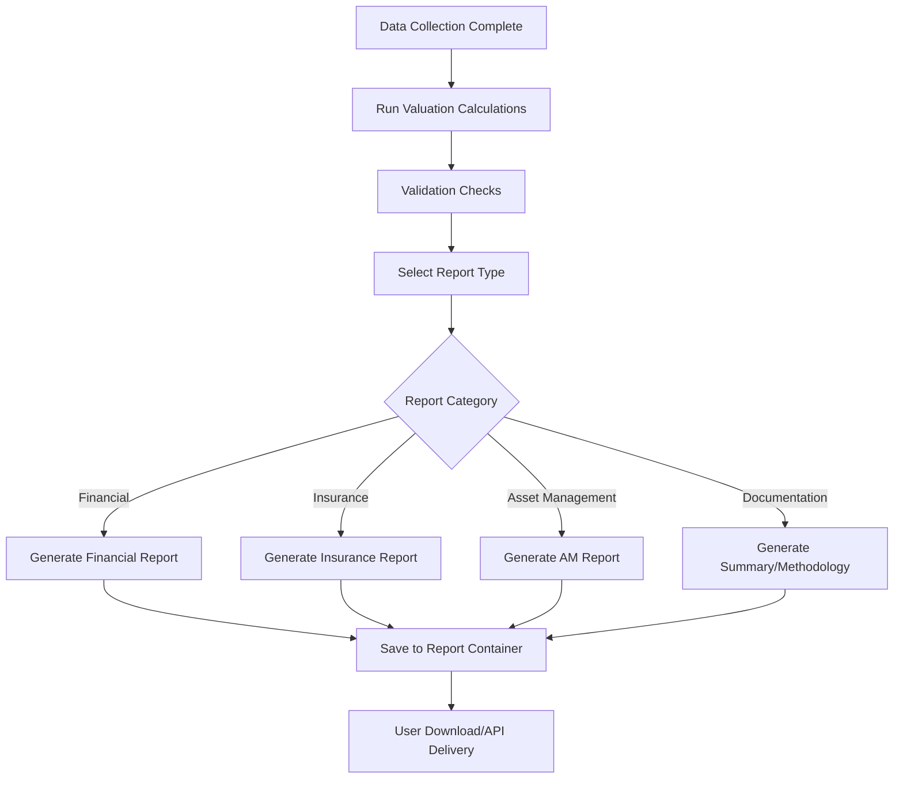

# Reporting Process Workflow Documentation

## Overview

This document outlines the **reporting workflow** in **Asset Valuer Pro (AVP)**, covering how reports are triggered, generated, formatted, stored, and delivered. It is designed for:

* Engineers integrating reporting logic
* QA teams verifying report generation
* Analysts preparing outputs for clients

> **Objective**: Translate valuation data into standardized outputs across financial, insurance, asset management, and audit contexts.

---

## Business Context

Reporting is a critical final phase in AVP’s valuation lifecycle. Reports serve business needs such as:

* Financial disclosures (IFRS/AASB/IPSAS compliance)
* Insurance valuation summaries
* Asset renewal planning and lifecycle forecasting
* Audit trail creation and peer review

---

## Workflow Diagram

---

## Reporting Workflow Stages

### Step 1: Data Validation

* Check required fields are populated
* Validate updated calculations
* Ensure consistency in asset records

🔧 Technical:

* `AssetController.cs`
* Frontend validation in `ReportingPage.tsx`
* Validator logic for calculation status and missing fields

### Step 2: Report Type Selection

* User selects report type and parameters (e.g., Job ID, Asset Class)
* Triggers backend generation

🔧 Technical:

* `Reporting.tsx` (UI)
* `ReportsController.cs` (API layer)

### Step 3: Report Generation

* Fetch required valuation, asset, and metadata
* Transform data into report schema
* Use builder tools (e.g., ExcelFileBuilder)

🔧 Key components:

* `ReportCalculationService.cs`
* `/Application/Reports/Queries/...`
* `ExcelFileBuilder.cs`, `IDocumentBuilderService.cs`

### Step 4: Storage & Delivery

* Reports saved to blob storage
* Metadata indexed by job and type
* UI/API for download access

🔧 Components:

* `ReportList.tsx`
* BlobStorage/CloudFileService backend

---

## Report Types by Category

### Financial Reports

| Name                     | Handler                                 | Output                                    |
| ------------------------ | --------------------------------------- | ----------------------------------------- |
| General Valuation        | `GetGeneralValuationReportsQuery`       | Excel multi-tab with asset-level data     |
| Movements Reconciliation | `GetMovementsReconciliationReportQuery` | Period-to-period valuation delta          |
| Depreciation Analysis    | `GetDepreciationAnalysisReportQuery`    | Depreciation behavior by asset class/type |

### Insurance Reports

| Name                | Handler                             | Output                           |
| ------------------- | ----------------------------------- | -------------------------------- |
| Insurance Valuation | `GetInsuranceValuationReportsQuery` | Replacement and indemnity values |
| Contents Insurance  | Included in above                   | Itemized content valuation       |

### Asset Management Reports

| Name                  | Handler                             | Output                         |
| --------------------- | ----------------------------------- | ------------------------------ |
| Distribution by Score | `GetDistributionByScoreReportQuery` | Asset condition score analysis |
| Renewal Cost          | `GetRenewalCostReportQuery`         | Projected costs by year/type   |
| Cost to Satisfactory  | `GetCostToBringToSatisfactoryQuery` | Required remediation by asset  |
| Maintenance Plan      | `GetMaintenancePlanReportQuery`     | Forecasted maintenance cycles  |

### Documentation Reports

| Name                 | Handler                             | Output                                     |
| -------------------- | ----------------------------------- | ------------------------------------------ |
| Methodology Report   | `GetMethodologyReportQuery`         | Word document explaining valuation methods |
| Summary Report       | `GetSummaryReportQuery`             | Executive-friendly snapshot                |
| Modified Assumptions | `GetModifiedAssumptionsReportQuery` | Changes to rules, profiles, or cost inputs |

---

## Report Output Formats

### Excel (.xlsx)

* Main format for data-heavy reports
* Tabs for different sections
* Pivot-ready tables and charts
* Client branding (logo, headers)

### Word (.docx)

* Used for Methodology and Summary Reports
* Based on fillable templates
* Suitable for editing and printing

### PDF (via Word conversion)

* Deliverable format
* Watermarked drafts if applicable

### CSV

* Lightweight, integration-friendly
* Used in some asset export scenarios

---

## Technical Challenges & Solutions

| Challenge    | Solution                              |
| ------------ | ------------------------------------- |
| Data volume  | Paginated retrieval, async handlers   |
| Custom logic | Parameter-based branching in handlers |
| Performance  | Optimized SQL + minimal includes      |
| Branding     | Template + logo injection             |
| Output size  | Streamed generation for large files   |

---

## Integration Touchpoints

* Output can feed external systems:

  * Financial ERP (depreciation schedules)
  * Insurance tools
  * Audit/BI platforms
* Supports naming conventions, folder structures, and custom parameters

---

## Business Value

This workflow supports:

* Regulatory compliance
* Data transparency and audit readiness
* Budget and insurance planning
* Executive communication
* Continuous improvement via documentation

---

## Related Docs

* [Valuation Process Workflow](Valuation_Process_Workflow)
* [Reports README](../Reports/README)
* [Field Data Collection](Field_Data_Collection_Workflow)
* [Valuation Fields Dictionary](../DataDictionary/Valuation_Fields_Dictionary)
* [ReportsController API](../Controller/ReportsController)
