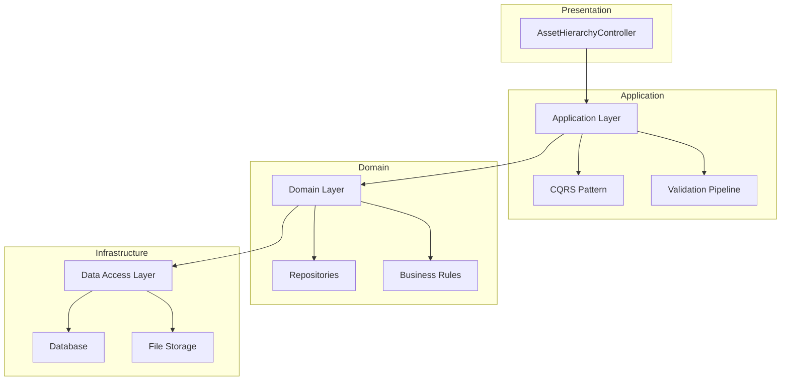

# AssetHierarchyController

<!-- ## Table of Contents
1. [Overview](#overview)
2. [Architectural Context](#architectural-context)
3. [Hierarchy Structure](#hierarchy-structure)
   - [Asset Classification](#asset-classification)
   - [Component Classification](#component-classification)
4. [API Endpoints](#api-endpoints)
   - [GetAssetClassNodes](#1-get-getassetclassnodes)
   - [GetAssetTypeNodes](#2-get-getassettypenodes)
   - [UpdateHierarchyNode](#3-post-updatehierarchynode)
   - [DeleteHierarchyNode](#4-post-deletehierarchynode)
   - [Export](#5-post-export)
   - [Import](#6-post-import)
5. [Data Transfer Objects](#data-transfer-objects)
6. [Error Handling](#error-handling)
7. [Performance Considerations](#performance-considerations)
8. [Security Implementation](#security-implementation)
9. [Integration Patterns](#integration-patterns)
10. [Testing Approach](#testing-approach)
11. [Versioning Strategy](#versioning-strategy)
12. [Monitoring and Diagnostics](#monitoring-and-diagnostics) -->

## Overview

The `AssetHierarchyController` is a core API controller that manages the hierarchical classification system for assets and their components. It implements a tree-like structure that enables systematic organization of assets from broad categories to specific components.

## Architectural Context



## Hierarchy Structure
The system implements a strict parent-child relationship model with these levels:

### Asset Classification
1. **Asset Class** (Top-level category)
   - Example: `Buildings`, `Infrastructure`, `Equipment`
   - Properties: `ID`, `Name`, `Description`, `ClientID`

2. **Asset Type** (Second level)
   - Example: `Commercial`, `Residential`, `Industrial`
   - Properties: `ID`, `AssetClassID`, `Name`, `Description`

3. **Asset Subtype** (Most specific asset classification)
   - Example: `Office`, `Retail`, `Apartment`
   - Properties: `ID`, `AssetTypeID`, `Name`, `Description`

### Component Classification
1. **Component Name** (Top-level component)
   - Example: `Roof`, `Structure`, `HVAC`

2. **Component Type** 
   - Example: `Metal`, `Concrete`, `Wood`

3. **Component Subtype**
   - Example: `Reinforced`, `Prefabricated`

## API Endpoints
### 1. GET /GetAssetClassNodes
Purpose: Retrieves root-level asset classes

Request:

```http
GET /api/AssetHierarchy/GetAssetClassNodes?clientId=123&includeInactive=false
```
Response:

```json
{
  "data": [
    {
      "id": 1,
      "name": "Buildings",
      "description": "All building structures",
      "hasChildren": true,
      "metadata": {
        "created": "2023-01-15T08:00:00Z",
        "modified": "2023-06-20T14:30:00Z"
      }
    }
  ],
  "pagination": {
    "totalCount": 5,
    "pageSize": 20
  }
}
```
### 2. GET /GetAssetTypeNodes
Purpose: Retrieves asset types for a specified class

Parameters:

```csharp
public class GetAssetTypeNodesQuery {
    [Required]
    public int AssetClassId { get; set; }
    
    [Range(1, 3)]
    public int Depth { get; set; } = 1;
}
```
### 3. POST /UpdateHierarchyNode
Validation Logic:

```csharp
public class UpdateHierarchyNodeValidator : AbstractValidator<UpdateHierarchyNodeCommand> {
    public UpdateHierarchyNodeValidator() {
        RuleFor(x => x.Name)
            .NotEmpty()
            .MaximumLength(100)
            .MustAsync(BeUniqueName).WithMessage("Name must be unique within level");
        
        RuleFor(x => x.NodeType)
            .IsInEnum()
            .Must(BeValidForClient);
    }
}
```
### 4. POST /DeleteHierarchyNode
Deletion Process:

- Verify no child nodes exist
- Check for asset references
- Validate user permissions
- Execute soft delete
- Publish deletion event

### 5. POST /Export
Supported Formats:
- Excel (.xlsx)
- JSON
- XML

Export Structure Example:

```csv
NodeType,ParentId,Name,Description,CustomFields
AssetClass,,Buildings,All building structures,
AssetType,1,Commercial,Commercial properties,
```

### 6. POST /Import
Import Workflow:

```mermaid
sequenceDiagram
    title Asset Hierarchy Import Workflow
    actor User
    participant Client
    participant API as API Controller
    participant Validator
    participant Processor
    participant Database

    User->>Client: Uploads import file
    Client->>+API: POST /api/import
    API->>+Validator: validate(file)
    
    alt Invalid file
        Validator-->>-API: Error details
        API-->>-Client: 400 Bad Request
        Client->>User: Show errors
    else Valid file
        Validator-->>-API: Validation OK
        API->>+Processor: processImport()
        Processor->>+Database: bulkInsert()
        Database-->>-Processor: Inserted 42 rows
        Processor-->>-API: Import complete
        API-->>-Client: 200 Success
        Client->>User: Show success
    end
```

## Data Transfer Objects
### Core DTO Structure
```csharp
public abstract class HierarchyNodeDto {
    public int Id { get; set; }
    
    [Required]
    [StringLength(100)]
    public string Name { get; set; }
    
    [StringLength(500)]
    public string Description { get; set; }
    
    public bool HasChildren { get; set; }
    public DateTime ModifiedDate { get; set; }
    public string ModifiedBy { get; set; }
}

public class AssetClassNodeDto : HierarchyNodeDto {
    public int ClientId { get; set; }
    public List<CustomFieldDto> CustomFields { get; set; }
}
```
### Error Handling
Error Response Schema:

```json
{
  "type": "https://tools.ietf.org/html/rfc7231#section-6.5.1",
  "title": "Validation Error",
  "status": 400,
  "traceId": "00-abcdef1234567890-1234567890abcdef-00",
  "errors": {
    "Name": ["The Name field is required."],
    "ParentId": ["Specified parent does not exist."]
  }
}
```

### Performance Considerations
Caching Configuration

```csharp
services.AddMemoryCache(options => {
    options.SizeLimit = 1024 * 1024 * 50; // 50MB
    options.CompactionPercentage = 0.2;
    options.ExpirationScanFrequency = TimeSpan.FromMinutes(1);
});

[ResponseCache(
    Duration = 300,
    VaryByQueryKeys = new[] { "clientId", "includeInactive" })]
public async Task<IActionResult> GetNodes() { ... }
```

### Security Implementation
Authorization Policies

```csharp
services.AddAuthorization(options => {
    options.AddPolicy("AssetHierarchyWrite", policy => 
        policy.RequireAssertion(context =>
            context.User.HasClaim("permission", "assets.hierarchy.manage") &&
            context.User.HasClaim("clientId", context.Resource.ClientId.ToString())));
});
```
### Integration Patterns
Event Contract
```csharp
public class HierarchyNodeChangedEvent : INotification {
    public int NodeId { get; set; }
    public NodeType NodeType { get; set; }
    public ChangeType ChangeType { get; set; }
    public string UserId { get; set; }
    public Dictionary<string, object> Metadata { get; set; }
}
```