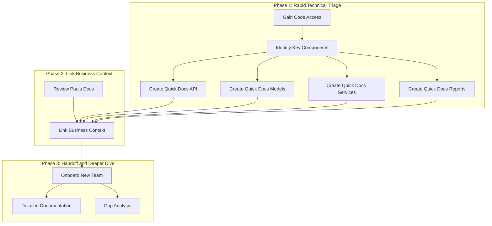

# 📋 Minimum Viable Documentation Plan for Asset Valuer Pro (AVP)

## 📝 Objective

Quickly create minimum viable technical documentation for the Asset Valuer Pro application to facilitate onboarding a new development team, leveraging existing high-level documentation and structured templates.

## 🔧 Source Materials

*   Paul's existing documentation (`legacy-docs/`) - Provides business context.
*   Provided templates (`templates/`) - Provides structure for technical details.
*   AVP Source Code (`legacy-code/`) - Provides the technical ground truth.

## 📋 Proposed Plan

The strategy is to leverage the provided templates, specifically the "QUICK DOCUMENTATION" sections, and populate them by analyzing the actual codebase once access is granted.

### 📋 Phase 1: Rapid Technical Triage (Requires Code Access)

1.  **Gain Access:** Obtain read-only access to the Bitbucket repository.
2.  **Identify Core Components:** Browse the codebase to identify the main technical components:
    *   API Controllers (e.g., in `Controllers`)
    *   Data Models/Entities (e.g., in `Models` or `Entities`)
    *   Key Business Logic Services (e.g., in `Services` or `BusinessLogic`)
    *   Report Generation Logic (e.g., in `Services`, `Reports`)
3.  **Create Quick Docs:** For each *key* component identified:
    *   Create a new Markdown file (e.g., `${REPO_ROOT}/working-folder/technical-docs/API/AssetController.md`).
    *   Copy the relevant template (API, Data Model, Service, Report).
    *   Focus *exclusively* on filling out the **"QUICK DOCUMENTATION"** section (File Path, Primary Purpose, Key Endpoints/Fields/Methods, Related Models, Used By).
    *   Store these files in an organized directory structure (e.g., `${REPO_ROOT}/working-folder/technical-docs/`).

### 📋 Phase 2: Link Business Context

1.  **Cross-Reference:** Briefly review Paul's `Overview.md` and other existing docs. Where obvious connections exist between a business process and a technical component, add a simple note/link in the technical doc.
2.  **(Optional) Quick Business Process Mapping:** Use the "QUICK DOCUMENTATION" section of the Business Process template for 1-2 high-level process maps, listing key technical components involved.

### 📋 Phase 3: Handoff & Deeper Dive (New Team)

1.  **Onboarding:** Use the generated "Quick Docs" as primary technical onboarding material.
2.  **Detailed Documentation:** The new team progressively fills out the "DETAILED DOCUMENTATION" sections.
3.  **Gap Analysis:** The new team uses the Gap Analysis template later for formal analysis.

## 🏗️ Visual Plan (Mermaid Diagram)

## ✅ [COMPLETED] Next Steps

> **Note**: All steps in this plan have been successfully completed. For current documentation status, please refer to the comprehensive documentation in `${REPO_ROOT}/working-folder/technical-docs/`. The new development team should use the `${REPO_ROOT}/working-folder/technical-docs/Handoff_Guide.md` as their starting point.