# Asset Valuer Pro (APV) Business Process Map

## Overview
This document provides a visual map of the core business processes in Asset Valuer Pro and shows how they relate to each other. The map illustrates the sequential flow and relationships between processes, highlighting their integration points and dependencies.

## Process Relationships Diagram

```mermaid
flowchart TD
    classDef started fill:#ffcc00,stroke:#333,stroke-width:1px
    classDef completed fill:#00cc66,stroke:#333,stroke-width:1px
    classDef notStarted fill:#ff6666,stroke:#333,stroke-width:1px
    classDef subProcess fill:#e6f7ff,stroke:#333,stroke-width:1px
    classDef external fill:#f2f2f2,stroke:#333,stroke-width:1px

    %% Main Process Flow
    Start([New Valuation Requirement]) --> FSP[File Setup & Configuration Process]
    FSP --> DCP[Data Collection Process]
    DCP --> CRP[Calculation & Reporting Process]
    CRP --> PVP[Post-Valuation Process]
    PVP --> End([Completed Valuation Cycle])
    
    %% File Setup & Configuration Sub-processes
    FSP --> FSP1[Create Client & License]:::subProcess
    FSP --> FSP2[Create Users & Roles]:::subProcess
    FSP --> FSP3[Create Valuation Framework]:::subProcess
    FSP --> FSP4[Define Asset Hierarchy]:::subProcess
    FSP --> FSP5[Configure Assumptions]:::subProcess
    FSP --> FSP6[Create Valuation Job]:::subProcess
    FSP --> FSP7[Import Initial Asset Register]:::subProcess
    
    %% Data Collection Sub-processes
    DCP --> DCP1[Analyze Data Requirements]:::subProcess
    DCP --> DCP2[Prepare Mobile Data Collection]:::subProcess
    DCP --> DCP3[Export Data to Mobile App]:::subProcess
    DCP --> DCP4[Conduct Field Inspections]:::subProcess
    DCP --> DCP5[Synchronize Field Data]:::subProcess
    DCP --> DCP6[Import Data into AVP]:::subProcess
    DCP --> DCP7[Validate Collected Data]:::subProcess
    
    %% Calculation & Reporting Sub-processes
    CRP --> CRP1[Run Calculations]:::subProcess
    CRP --> CRP2[Validate Calculation Results]:::subProcess
    CRP --> CRP3[Generate Reports]:::subProcess
    CRP --> CRP4[Save Reports]:::subProcess
    CRP --> CRP5[Review Results with Client]:::subProcess
    CRP --> CRP6[Finalize Valuation]:::subProcess
    
    %% Post-Valuation Sub-processes
    PVP --> PVP1[Update Job Status]:::subProcess
    PVP --> PVP2[Support Audit Process]:::subProcess
    PVP --> PVP3[Export Client-Ready Data]:::subProcess
    PVP --> PVP4[Archive Completed Job]:::subProcess
    PVP --> PVP5[Prepare for Future Valuations]:::subProcess
    
    %% Integration Points & Dependencies
    Client([Client Systems]):::external <--> FSP7
    Client <--> DCP6
    Client <--> PVP3
    Audit([Audit Process]):::external <--> PVP2
    MobileApp([Mobile Capture App]):::external <--> DCP3
    MobileApp <--> DCP5
    
    %% Apply classes to main processes
    class FSP completed
    class DCP completed
    class CRP completed
    class PVP completed
    
    %% Legend
    subgraph Legend
        L1[Completed Process]:::completed
        L2[In Progress]:::started
        L3[Not Started]:::notStarted
        L4[Sub-Process]:::subProcess
        L5[External System]:::external
    end
```

## Process Descriptions

### 1. File Setup & Configuration Process
- **Purpose**: Establishes the foundation for performing valuations
- **Inputs**: Client information, license requirements, asset classification structure
- **Outputs**: Configured client, users, valuation framework, asset hierarchy, assumptions, valuation job
- **Next Process**: Data Collection Process

### 2. Data Collection Process
- **Purpose**: Gathers and validates all required data for valuations
- **Inputs**: Initial asset register, valuation framework, created job
- **Outputs**: Complete dataset ready for valuation calculations
- **Previous Process**: File Setup & Configuration
- **Next Process**: Calculation & Reporting

### 3. Calculation & Reporting Process
- **Purpose**: Performs valuation calculations and generates reports
- **Inputs**: Complete asset data, configured assumptions
- **Outputs**: Calculated valuations, various reports
- **Previous Process**: Data Collection
- **Next Process**: Post-Valuation

### 4. Post-Valuation Process
- **Purpose**: Finalizes, audits, and archives completed valuations
- **Inputs**: Finalized valuation results, audit requirements
- **Outputs**: Archived valuation job, client-ready data
- **Previous Process**: Calculation & Reporting
- **Outcome**: Completed valuation cycle

## Key Integration Points

1. **Client Systems Integration**:
   - Initial asset register import
   - Data validation against client records
   - Export of final valuation data for client systems

2. **Mobile Data Collection Integration**:
   - Export of asset data to mobile app
   - Field data collection
   - Synchronization of collected data back to AVP

3. **Audit Process Integration**:
   - Support for external audit requirements
   - Documentation provision
   - Valuation methodology verification

## Process Cycle and Iteration

The diagram shows the linear progression of a valuation cycle, but in practice, there may be iterations within each process:

- Data collection may identify issues requiring updates to the file setup
- Calculation results may identify data gaps requiring additional collection
- Audit review may require recalculation of certain valuations

## Status of Process Documentation

All core processes have been documented at a medium confidence level, with specific information gaps identified for business unit review.

## Next Steps for Process Map Development

1. **Verify process relationships** with business unit
2. **Add decision points** at key process junctions
3. **Expand sub-process details** based on business unit feedback
4. **Link technical implementation** to business processes