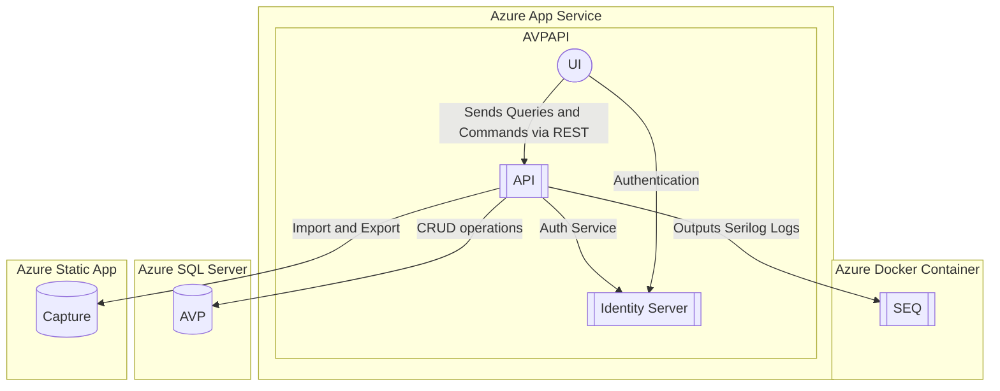

```mermaid
flowchart TB

subgraph Azure Docker Container
    SEQ[[SEQ]]
end
subgraph Azure App Service
    reactapp([UI]) -->|Sends Queries and Commands via REST| API
    subgraph AVPAPI
        API[[API]] -->|Auth Service| IdentityServer[[Identity Server]]
        reactapp -->|Authentication| IdentityServer
        API -->|Outputs Serilog Logs| SEQ
    end
end

subgraph Azure SQL Server
    AVP[(AVP)]
    API -->|CRUD operations| AVP
end

subgraph Azure Static App
    pwa[(Capture)]
    API -->|Import and Export| pwa

end
```

