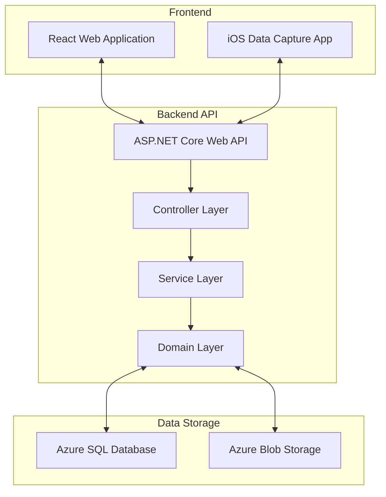
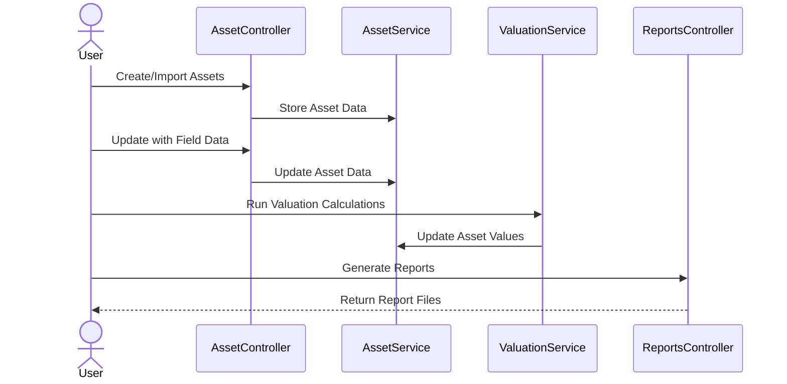
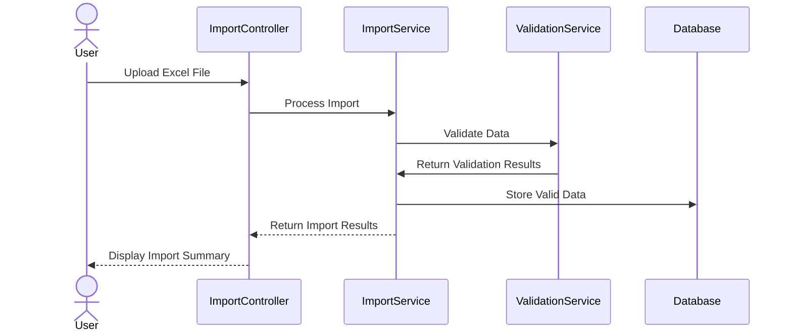

# 🏗️ Asset Valuer Pro: Business-Technical Overview

> **⚠️ Important Note:**  
> This documentation describes the business and technical aspects of Asset Valuer Pro, but the actual source code is maintained in a separate repository and is not included in this documentation repository.

## 📋 Introduction

This document provides a high-level overview of Asset Valuer Pro (APV), connecting the business purpose and processes with their technical implementations. It serves as an orientation for new developers to understand how business requirements are realized in the codebase.

## 📝 Business Background

According to the legacy documentation, Asset Valuer Pro was developed in the early 2010s to address specific business challenges:

1. Difficulty in onboarding new staff due to the specialized knowledge required in:
   - Valuation methodologies
   - Accounting standards
   - Financial reporting requirements
   - Excel proficiency
   - Local government asset knowledge

2. The need to leverage intellectual property by making the database cloud-based and available to external entities

## 📝 Core Business Functions

Despite its name, Asset Valuer Pro delivers more than just valuations. The system provides:

1. **Financial reporting valuations** under IFRS and IPSAS standards
2. **Insurance valuations** (replacement and indemnity values)
3. **Asset management outputs** including:
   - Lifecycle optimization modeling (EasySAM)
   - Projected renewals reporting
   - Cost to bring assets to satisfactory condition
   - Portfolio analysis by condition or value
4. **Financial statement disclosures** including:
   - Movements reconciliation
   - Valuation measurement disclosures
   - Other disclosure note information

## 🏗️ System Architecture Overview

The technical implementation uses a modern web architecture:

## 📋 Core Business Processes and Technical Implementation

### 📋 1. Setting Up a File

**Business Process**: 
- Create client and license
- Create users and roles
- Create valuation framework (asset hierarchy and assumptions)
- Create valuation job
- Register assets

**Technical Implementation**:
- `ClientController.cs` and `SubscriptionController.cs` manage clients and licenses
- `UserController.cs` and `RoleController.cs` handle user management
- `AssetHierarchyController.cs` and related controllers establish hierarchies
- `JobController.cs` manages valuation jobs
- `AssetController.cs` and `ImportController.cs` handle asset registration

### 📋 2. Collecting Key Data

**Business Process**:
- Field data collection via mobile app (currently File Maker Pro on iPad)
- Import from client systems (Excel)
- Validate and enrich data

**Technical Implementation**:
- `ContentController.cs` handles mobile data synchronization
- `ImportController.cs` and `ImportService.cs` manage data imports
- `ValidationService.cs` validates imported data

### 📋 3. Valuation Calculations

**Business Process**:
- Apply different valuation methodologies based on asset type:
  - Market approach for assets with active markets
  - Income approach for income-generating assets
  - Cost approach for community benefit assets
- Run calculations to determine current values

**Technical Implementation**:
- Valuation methods implemented in various classes:
  - `MarketValuationMethod.cs`
  - `IncomeValuationMethod.cs`
  - `ApportionmentCostValuationMethod.cs`
  - `DirectCostValuationMethod.cs`
  - `HistoricalCostValuationMethod.cs`
- `RefreshJobDataService.cs` orchestrates calculation processes

### 📋 4. Reporting

**Business Process**:
- Generate financial reporting valuations
- Generate insurance valuations
- Produce asset management outputs
- Create financial statement disclosures

**Technical Implementation**:
- `ReportsController.cs` manages report generation
- Various report generator classes implement specific reports
- `BlobStorageService.cs` stores generated reports

## 🔗 Key Technical Components and Business Alignment

### 📊 Data Models

| Business Entity | Technical Implementation | Purpose |
|-----------------|--------------------------|---------|
| Asset | `Asset.cs` | Represents physical assets being valued |
| Asset Class | `AssetClass.cs` | Top-level asset categorization |
| Component | `Component.cs` | Parts of assets with different lifecycles |
| Job | `Job.cs` | Represents a valuation at a point in time |
| Valuation Profile | `ValuationProfile.cs` | Defines valuation parameters |

### 🔧 Core Services

| Business Function | Technical Implementation | Purpose |
|-----------------|--------------------------|---------|
| Asset Import | `ImportService.cs` | Imports asset data from Excel |
| Calculation | `RefreshJobDataService.cs` | Performs valuation calculations |
| Field Data Collection | `ContentService.cs` | Manages mobile data collection |
| Reporting | `ReportService.cs` | Generates valuation reports |

### 🔄 Key Workflows

#### 📋 Asset Valuation Workflow

#### 📋 Data Import Workflow

## 📋 Integration with External Systems

According to the legacy documentation, Asset Valuer Pro is designed to work alongside but separate from an entity's ERP or finance system:

> It is important to note that the valuation process must be undertaken external to any live data held in an entity's ERP or finance system. A valuation is undertaken at a point in time and the process (including final audit review) can sometimes take more than six months. The data held in the valuation must be quarantined from live data to ensure agreed valuation results are not impacted by changes to the live data.

The technical implementation supports this through:
- Isolated database for valuation data
- Import/export capabilities for data exchange
- Job-based isolation of valuation processes
- Point-in-time snapshots of asset data

## 📋 Technical Component Distribution

The system's business functionality is distributed across controllers as follows:

### 🏗️ Setup and Configuration
- ClientController
- UserController
- RoleController
- SubscriptionController
- AssetHierarchyController
- ValuationProfileController

### 📊 Asset Management
- AssetController
- ComponentController
- AssetClassController
- AssetTypeController
- AssetSubTypeController

### 📝 Data Collection
- ImportController
- ContentController
- DocumentController

### 🧮 Calculation
- RefreshJobDataService
- ValuationMethodServices

### 📄 Reporting
- ReportsController
- Report generator implementations

## 🔄 Next Steps

New developers should:
1. Review the business processes in the legacy documentation
2. Understand how these processes are implemented in the codebase
3. Reference this documentation when making changes to ensure business requirements continue to be met
