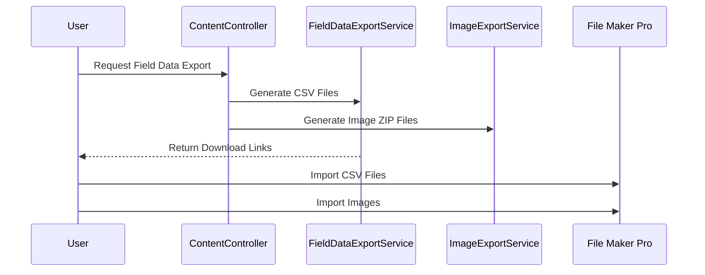
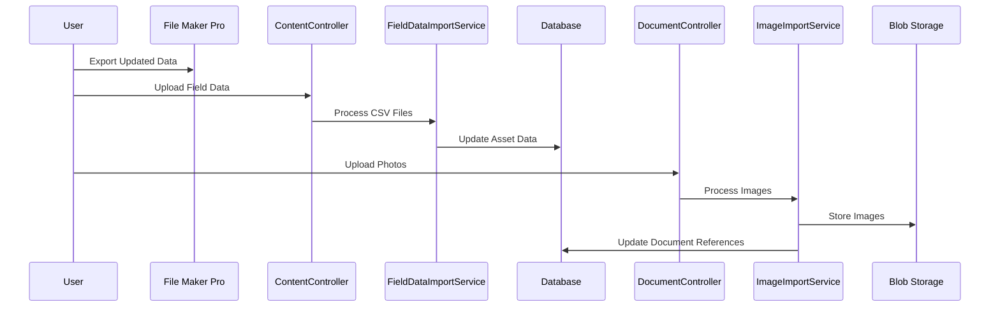

# 📱 Mobile Data Collection Technical Documentation

> **⚠️ Important Note:**  
> This documentation describes the mobile data collection functionality, but the actual source code is maintained in a separate repository and is not included in this documentation repository.

## 📋 Overview
This document describes the technical implementation of the mobile data collection functionality in Asset Valuer Pro.

> **⚠️ Version Note:**  
> The legacy documentation describes a previous File Maker Pro app running on iPads for field data collection. This has been replaced by the current iOS app (version 3), which is now the only supported mobile collection solution in production.

## 📋 Business Context

### 📋 Purpose
According to the legacy documentation, field data collection serves these key business purposes:
- Gathering inspection data for buildings and structures
- Validating infrastructure data provided by clients
- Capturing photos and physical attributes of assets
- Recording condition scores essential for valuation calculations

### 📋 Data Flow Process

The legacy documentation describes this data flow:
1. Data from Asset Valuer Pro is exported to CSV files
2. Images are exported to zip files
3. Data is imported into File Maker Pro running on the valuer's PC
4. Data is synchronized to the iPad
5. Field inspections are performed
6. Data is synchronized back to the PC
7. Data is exported from File Maker Pro
8. Data is imported back into Asset Valuer Pro

## 🏗️ Technical Implementation

### 🔧 Legacy Implementation (File Maker Pro) ❌ Deprecated
According to the legacy documentation, the previous mobile data collection system used:
- **File Maker Pro**: Primary data collection application
- **iPad Devices**: Field data collection hardware
- **CSV Export/Import**: Data transfer mechanism between APV and File Maker Pro
- **Zip Files**: Image transfer mechanism

> **Note:** This implementation is no longer supported and has been fully replaced by the iOS native app.

### 🔧 Current Implementation (iOS Native App) ✅ Supported
The current implementation (version 3) uses:
- **React Native/Expo**: Cross-platform mobile development framework
- **iOS Native Components**: For camera and other device functionality
- **REST API Integration**: Direct API communication rather than CSV export/import
- **Blob Storage**: For image management

> **Note:** This is the current supported solution running on iOS/iPadOS.

### 🔧 Integration Points
The primary technical integration points are:

1. **Content Controller**: Manages the export and import of field data
   - File Path: `API/Controllers/ContentController.cs`
   - Key Endpoints:
     - `/ExportFieldData`: Prepares data for File Maker Pro
     - `/ImportFieldData`: Processes returned field data

2. **Document Controller**: Manages photos and other documents
   - File Path: `API/Controllers/DocumentController.cs`
   - Key Endpoints:
     - `/Upload`: Handles document uploads
     - `/GetDocumentsByAsset`: Retrieves documents for a specific asset

3. **Import/Export Services**: Handle data transformation
   - `FieldDataExportService.cs`: Creates CSV files for export
   - `FieldDataImportService.cs`: Processes imported CSV files
   - `ImageExportService.cs`: Creates image zip files
   - `ImageImportService.cs`: Processes imported images

## 📋 Inspection Data Fields

The mobile application captures these key data types:

| Data Category | Fields | Technical Implementation |
|---------------|--------|--------------------------|
| Asset Identification | Asset ID, Name, Reference Number | `AssetOfflineDto.cs` |
| Location Information | Address, Coordinates, Site Details | `AssetLocationDto.cs` |
| Physical Attributes | Dimensions, Materials, Construction Type | `AssetAttributesDto.cs` |
| Condition Assessment | Condition Scores, Defect Notes | `AssetConditionDto.cs` |
| Photos | Primary Photo, Detail Photos | `AssetDocumentDto.cs` |
| Inspection Details | Inspector, Date, Weather Conditions | `InspectionDto.cs` |

## 🏗️ Data Synchronization

### 🔧 Export Process (APV to File Maker Pro)

### 🔧 Import Process (File Maker Pro to APV)

## 🔧 Key Technical Components

### 📊 Data Models
- `AssetOfflineDto.cs`: Data transfer object for asset data to/from mobile app
- `InspectionDto.cs`: Captures inspection metadata
- `AssetConditionDto.cs`: Stores condition assessment data
- `AssetDocumentDto.cs`: Manages document references

### 🏗️ Services
- `FieldDataExportService.cs`: Prepares data for export to File Maker Pro
- `FieldDataImportService.cs`: Processes data imported from File Maker Pro
- `ValidationService.cs`: Validates imported data
- `SyncService.cs`: Manages synchronization state

### 🔧 Controllers
- `ContentController.cs`: Handles import/export operations
- `DocumentController.cs`: Manages document uploads and retrieval

## 📋 Current Implementation Notes

> **✅ Version Note:**  
> Version 3 with the iOS native app is the current production version and the only supported mobile solution.

The iOS native app provides these advantages over the legacy system:

1. Direct data synchronization with the APV backend
2. Modern field data collection user interface
3. Direct API-based data submission rather than CSV import/export
4. Improved performance and reliability

The iOS implementation uses React Native/Expo as indicated in the Repository Structure document, providing a robust and maintainable solution for field data collection.

## 🔒 Security Considerations

- Mobile devices require authentication before accessing APV data
- Field data is encrypted during transfer
- Temporary files are securely deleted after import
- Only authorized users can upload field data
