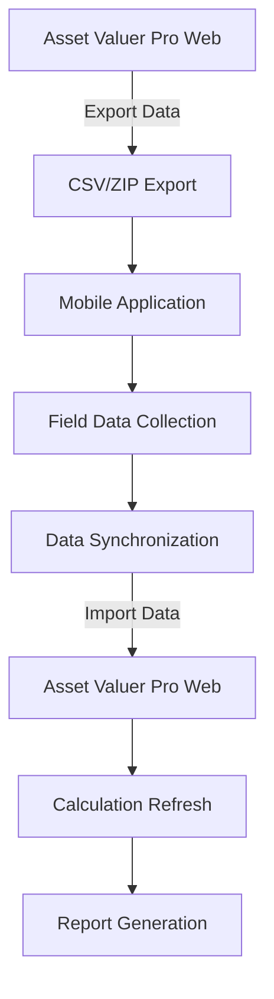

# 📋 Field Data Collection Workflow

## 📋 Overview
This document describes the technical implementation of the field data collection process in Asset Valuer Pro. It outlines how the mobile data collection app interacts with the core system, the data flow between components, and the business context for this functionality.

## 📋 Business Context
According to the legacy documentation, field data collection is a critical part of the valuation process, particularly for buildings, structures, and other physical assets. The process involves:

1. Exporting data from Asset Valuer Pro to a mobile device
2. Collecting data in the field (measurements, conditions, photographs)
3. Synchronizing collected data back to Asset Valuer Pro
4. Incorporating field data into valuation calculations

## 🏗️ Technical Process Flow



## 📋 Mobile App Architecture

> **⚠️ Version Note:**  
> The legacy documentation describes a File Maker Pro app running on iPads for field data collection, while the repository contains a React Native/Expo iOS app. This suggests the version 3 transition mentioned in legacy documentation may be underway or completed. Both implementations are documented here for completeness.

### Version 2 Architecture
In version 2, the mobile data collection uses File Maker Pro:
- Data exported from Asset Valuer Pro to CSV files
- Images exported as ZIP files
- File Maker Pro app running on iPad accesses exported data
- Synchronized back to PC via File Maker Pro
- Data re-imported to Asset Valuer Pro

### Version 3 Architecture
Version 3 uses a custom iOS app with:
- Direct API integration with Asset Valuer Pro
- Offline capability with local storage
- Automatic synchronization when online
- Built-in photo management
- Asset scanning and barcode recognition

## 📋 Data Flow Process

### Step 1: Data Export
#### Business Process
- Select assets for field inspection
- Export relevant data to mobile format
- Transfer data to mobile device

#### Technical Implementation
- `ExportAssetsModal.tsx` - UI for selecting export options
- `ImportController.cs` - Handles data export in backend
- Export formats:
  - Asset data as CSV
  - Images as ZIP files
  - Reference data as JSON

#### Key API Endpoints
- GET `/api/asset/export` - Export asset data for mobile app
- GET `/api/asset/exportImages` - Export images for mobile app

### Step 2: Mobile Data Collection
#### Business Process
- Field inspectors visit asset locations
- Collect measurements, condition scores, photos
- Record observations and notes
- Validate data completeness in the field

#### Technical Implementation
- iOS mobile application (in version 3)
- File Maker Pro (in version 2)
- Key features:
  - Offline data capture
  - GPS integration for location validation
  - Camera integration for photos
  - Condition score interface
  - Notes and observations capture

#### Data Structure
Mobile app captures these key fields:
- Asset identification (ID, reference)
- Condition scores (1-10 scale)
- Dimensions (length, width, area)
- Photographs with metadata
- Inspector notes and observations

### Step 3: Data Synchronization
#### Business Process
- Connect mobile device to network
- Synchronize collected data back to main system
- Validate data completeness and quality

#### Technical Implementation
- `ImportController.cs` - `/api/import/fieldData` endpoint
- `ContentController.cs` - Handles photo uploads
- Data validation in `AssetFileValidator.cs`

#### Synchronization Process
For version 2:
```
Field Device → PC Sync → CSV/ZIP Export → Asset Valuer Pro Import
```

For version 3:
```
Field Device → Direct API Upload → Asset Valuer Pro Database
```

### Step 4: Data Integration
#### Business Process
- Incorporate field data into asset records
- Update condition scores and measurements
- Attach photographs to asset records
- Update valuation based on new field data

#### Technical Implementation
- `AssetController.cs` - Updates asset records
- `ValuationService.cs` - Recalculates values based on new data
- Frontend components:
  - `AssetView.tsx` - Displays updated asset data
  - `ImageViewer.tsx` - Displays asset photographs

#### Key Processes
```csharp
// Simplified integration logic
public async Task<Unit> UpdateFromFieldData(FieldDataDto data) {
  var asset = await _context.Assets.FindAsync(data.AssetId);
  
  // Update condition scores
  asset.ConsumptionScore = data.ConsumptionScore;
  
  // Update dimensions
  asset.Length = data.Length;
  asset.Width = data.Width;
  asset.Area = data.Area;
  
  // Update status
  asset.Status = "Inspected";
  asset.InspectionDate = DateTime.Now;
  asset.InspectorName = data.InspectorName;
  
  // Save changes
  await _context.SaveChangesAsync();
  
  // Recalculate valuations
  await _mediator.Send(new RecalculateAssetCommand { AssetId = data.AssetId });
  
  return Unit.Value;
}
```

## 📋 Data Collection Requirements

### Essential Asset Data
The field data collection app focuses on these key elements:

#### Physical Attributes
- Dimensions (length, width, height, area)
- Materials and construction
- Location details (GPS coordinates)
- Age and condition

#### Condition Assessment
- Consumption score (1-10 scale)
- Physical observation notes
- Maintenance requirements
- Remaining useful life estimation

#### Visual Documentation
- Exterior photographs
- Interior photographs (where applicable)
- Detail photographs of specific components
- Documentation of defects or damage

### Mapping to Valuation Methodology
Data collected in the field directly impacts valuation through:
1. **Condition Scores**: Map to Remaining Service Potential (RSP) through Valuation Profiles
2. **Physical Measurements**: Used in replacement cost calculations
3. **Observed Defects**: Influence maintenance planning and useful life estimates

## 📊 Technical Components

### Mobile Application
- iOS application built for iPad (primary device)
- Local SQLite database for offline storage
- Camera integration for photo capture
- GPS integration for location validation
- Barcode/QR code scanning for asset identification

### Backend Integration
- `ImportController.cs` - Handles data import/export
- `ContentController.cs` - Manages photos and documents
- `AssetController.cs` - Updates asset data based on field input

### Database Entities
- `AssetValuation` - Stores updated condition scores and measurements
- `Note` - Stores inspector observations
- `Image` - Stores photographs and metadata

## 📝 Version Considerations

### Version 2 Specific
- Uses File Maker Pro as the mobile collection tool
- Requires manual export/import process
- Two-step synchronization (device to PC, PC to system)

### Version 3 Specific
- Custom iOS app with direct API integration
- Automatic synchronization when online
- Enhanced photo management
- Improved offline capabilities

## 📋 Technical Challenges and Solutions

| Challenge | Technical Solution |
|-----------|-------------------|
| Network Connectivity | Offline capability with local storage |
| Data Integrity | Validation at collection and import stages |
| Large Photo Files | Compression and progressive upload |
| User Experience | Intuitive mobile interface design |
| Synchronization Conflicts | Timestamp-based conflict resolution |
| Battery Life | Optimized app performance |

## 📋 Integration Points

### Field Data to Asset Record
Field data directly updates these asset properties:
- Physical attributes (dimensions, location)
- Condition scores and assessment
- Inspection status and metadata
- Photographs and visual documentation
- Inspector notes and observations

### Field Data to Valuation
Field data affects valuation through:
- Condition scores determining RSP percentage
- Updated measurements affecting replacement cost
- Observation notes influencing useful life estimates
- Defect documentation impacting maintenance planning

### Field Data to Reporting
Field data enhances reports via:
- Inspection status reporting
- Condition distribution analysis
- Visual documentation in reports
- Field notes inclusion in methodology reports

## 📝 Business Value

The field data collection workflow delivers significant value by:

1. **Accuracy**: Ensuring valuation is based on verified physical condition
2. **Evidence**: Providing photographic evidence for valuation decisions
3. **Efficiency**: Streamlining data collection with purpose-built tools
4. **Consistency**: Standardizing condition assessment methodology
5. **Documentation**: Creating comprehensive asset records
6. **Transparency**: Making valuation inputs clear and defensible

## 📋 Related Documentation

- [Valuation Process Workflow](Valuation_Process_Workflow.md) - Overall valuation process
- [Mobile Data Collection](../Mobile_Data_Collection.md) - Detailed mobile app documentation
- Asset model documentation: [Asset.md](../Models/Asset.md)
- Content controller documentation: [ContentController.md](../API/ContentController.md)
- Import controller documentation: [ImportController.md](../API/ImportController.md)
