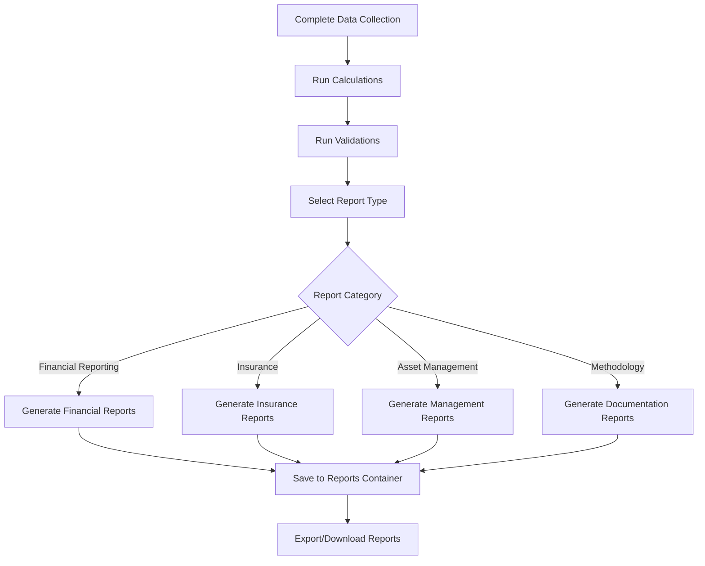

# 📊 Reporting Process Workflow

## 📋 Overview
This document outlines the technical implementation of the reporting process workflow in Asset Valuer Pro, detailing how reports are generated, the available report types, and how they map to business requirements.

## 📋 Business Context
According to the legacy documentation, reporting is a critical final step in the valuation process. After data collection and calculation, the system can generate various reports including:

- Financial reporting valuation reports
- Insurance valuation reports
- Asset management outputs (lifecycle optimization, renewals, etc.)
- Financial statement disclosures
- Summary and methodology reports

## 🏗️ Technical Process Flow



## 📋 Reporting Implementation

### Step 1: Data Validation
#### Business Process
- Validate all required data is present
- Ensure calculations are up-to-date
- Check for data inconsistencies

#### Technical Implementation
- Data validation through `AssetController.cs`
- Frontend validation in `ReportingPage.tsx`
- Key validation checks:
  - Missing required fields
  - Inconsistent valuation data
  - Calculation status

### Step 2: Report Selection
#### Business Process
- User selects report type from available categories
- Configure report parameters (asset class, format, etc.)
- Request report generation

#### Technical Implementation
- `Reporting.tsx` - Main reporting interface
- `ReportsController.cs` - Handles report requests
- Report parameters passed through API request

#### Frontend Components
```typescript
// Simplified report selection in React
function ReportSelection() {
  const [reportType, setReportType] = useState('');
  const [assetClass, setAssetClass] = useState('All');
  
  const handleGenerateReport = () => {
    api.post(`/api/reports/${reportType}`, { 
      jobId: currentJobId,
      assetClass: assetClass 
    });
  };
  
  return (
    <div>
      <select value={reportType} onChange={e => setReportType(e.target.value)}>
        <option value="GeneralValuation">General Valuation Report</option>
        <option value="InsuranceValuation">Insurance Valuation Report</option>
        {/* Additional report types */}
      </select>
      
      <button onClick={handleGenerateReport}>Generate Report</button>
    </div>
  );
}
```

### Step 3: Report Generation
#### Business Process
- Process report request
- Gather all required data
- Apply formatting and templates
- Generate output file

#### Technical Implementation
- `ReportsController.cs` - Routes to appropriate query handler
- Report query handlers in `/Application/Reports/Queries/`
- `ReportCalculationService.cs` - Performs report calculations
- `ExcelFileBuilder.cs` - Generates Excel output files

#### Report Generation Pattern
```csharp
// Simplified report generation pattern
public async Task<FileVm> Handle(GetReportQuery request, CancellationToken cancellationToken)
{
    // 1. Retrieve data
    var assets = await _context.AssetValuations
        .Where(a => a.JobId == request.JobId)
        .Include(/* required relationships */)
        .ToListAsync(cancellationToken);
        
    // 2. Create report data structure
    DataSet reportData = new DataSet();
    
    // 3. Add summary tables
    var summaryTable = _reportCalculationService
        .GetSummaryData(assets)
        .ToDataTable();
    reportData.Tables.Add(summaryTable);
    
    // 4. Add detail tables
    var detailTable = assets
        .Select(/* map to report structure */)
        .ToDataTable();
    reportData.Tables.Add(detailTable);
    
    // 5. Generate Excel file
    return new FileVm
    {
        Content = _excelFileBuilder.BuildFile(reportData),
        ContentType = "application/vnd.openxmlformats-officedocument.spreadsheetml.sheet",
        FileName = $"{request.ReportName}.xlsx"
    };
}
```

### Step 4: Report Storage
#### Business Process
- Save generated reports for future access
- Organize reports by job and type
- Allow retrieval without regeneration

#### Technical Implementation
- BlobStorage service for file storage
- Frontend access through `ReportList.tsx`

## 📊 Report Types and Technical Implementation

> **⚠️ Version Note:**  
> The legacy documentation mentions certain reports as "not currently in version 2 of the software" but planned for future versions. The repository contains implementations for many of these reports, suggesting that the version 3 features described in legacy documentation may be partially or fully implemented.

### Financial Reporting Reports

| Report Name | API Endpoint | Implementation | Description |
|-------------|--------------|----------------|-------------|
| General Valuation | `GetGeneralValuationReports` | `GetGeneralValuationReportsQuery.cs` | Comprehensive financial valuation data by asset and component |
| Movements Reconciliation | `GetMovementsReconciliationReport` | `GetMovementsReconciliationReportQuery.cs` | Changes in asset values between periods |
| Depreciation Analysis | `GetDepreciationAnalysisReport` | `GetDepreciationAnalysisReportQuery.cs` | Detailed analysis of depreciation calculations |

### Insurance Valuation Reports

| Report Name | API Endpoint | Implementation | Description |
|-------------|--------------|----------------|-------------|
| Insurance Valuation | `GetInsuranceValuationReports` | `GetInsuranceValuationReportsQuery.cs` | Replacement and indemnity values for insurance |
| Contents Insurance | `GetInsuranceValuationReports` | Part of Insurance Valuation Report | Valuation of asset contents for insurance |

### Asset Management Reports

| Report Name | API Endpoint | Implementation | Description |
|-------------|--------------|----------------|-------------|
| Distribution by Score | `GetDistributionByScoreReport` | `GetDistributionByScoreReportQuery.cs` | Analysis of assets by condition score |
| Distribution by Value | `GetDistributionByValueReport` | `GetDistributionByValueReportQuery.cs` | Analysis of assets by value bands |
| Renewal Cost | `GetRenewalCostReport` | `GetRenewalCostReportQuery.cs` | Projected asset renewal costs |
| Cost To Bring To Satisfactory | `GetCostToBringToSatisfactoryReport` | `GetCostToBringToSatisfactoryQuery.cs` | Cost to restore assets to satisfactory condition |
| Maintenance Plan | `GetMaintenancePlanReport` | `GetMaintenancePlanReportQuery.cs` | Scheduled maintenance activities and costs |
| Cash Flow Projections | `CashFlowProjections` | `GetCashFlowProjectionsQuery.cs` | Projected cash flows for asset management |
| Renewals Schedule | `RenewalsSchedule` | `GetRenewalsScheduleQuery.cs` | Detailed schedule of asset renewals |

### Documentation Reports

| Report Name | API Endpoint | Implementation | Description |
|-------------|--------------|----------------|-------------|
| Methodology Report | `GetMethodologyReport` | `GetMethodologyReportQuery.cs` | Documents the valuation methodology used |
| Summary Report | `GetSummaryReport` | `GetSummaryReportQuery.cs` | Executive summary of valuation results |
| Modified Assumptions | `ModifiedAssumptionsReport` | `GetModifiedAssumptionsReportQuery.cs` | Documents changes to valuation assumptions |

## 📊 Report Data Structure

### Asset Class Level Reports
Asset class level reports summarize data by asset class and typically include:
- Asset class identification
- Count of assets
- Summary valuation figures (gross, current value)
- Comparison to previous values
- Variance analysis

### Asset Level Reports
Asset level reports provide detailed information on individual assets:
- Asset identification (ID, reference, name)
- Asset classification (class, type, subtype)
- Location information
- Valuation data (gross, accumulated depreciation, current value)
- Insurance information
- Valuation method and inputs

### Component Level Reports
Component level reports break down assets into components:
- Component identification
- Component classification
- Valuation data for short-life and long-life portions
- Consumption scores and valuation profiles
- Depreciation details
- Replacement cost information

## 📋 Report Formats and Templates

### Excel Reports
The primary report format is Excel (.xlsx) with:
- Multiple tabs for different report sections
- Consistent formatting and styling
- Data tables with filtering capabilities
- Summary charts and visualizations
- Client branding and headers/footers

### Word/PDF Documents
Methodology and documentation reports use Word templates:
- Located in `/API/wwwroot/Templates/`
- System fills placeholders with generated content
- Consistent professional formatting
- Client branding and document standards
- Can be converted to PDF for distribution

### CSV Exports
Some data can be exported as CSV for further processing:
- Simple tabular format
- Compatible with external systems
- Suitable for large datasets
- Minimal formatting

## 📋 Technical Challenges and Solutions

| Challenge | Technical Solution |
|-----------|-------------------|
| Large Datasets | Paginated data retrieval and streaming response |
| Complex Calculations | Pre-calculated values stored in database |
| Report Formatting | Template-based approach with Excel builder |
| Performance | Optimized queries with selective includes |
| Client Customization | Parameterized reports with client settings |
| Version Control | Report templates versioned with codebase |

## 📋 Integration Points

### Financial Systems Integration
Reports can be used for financial system integration:
- Asset register updates
- Depreciation schedule imports
- Financial statement preparation
- Audit evidence and documentation

### Client Systems
Reports interface with client systems through:
- Consistent naming conventions
- Standard file formats (Excel, PDF, CSV)
- Metadata for document management systems
- Customizable outputs based on client requirements

## 📝 Business Value

The reporting workflow delivers significant business value through:

1. **Compliance**: Meeting financial reporting requirements (IFRS/IPSAS)
2. **Decision Support**: Providing data for asset management decisions
3. **Risk Management**: Supporting insurance coverage decisions
4. **Communication**: Facilitating understanding of complex valuation concepts
5. **Evidence**: Providing audit trail and valuation documentation
6. **Analysis**: Enabling trend analysis and comparison over time

## 📋 Related Documentation

- [Valuation Process Workflow](Valuation_Process_Workflow.md) - Overall valuation process
- [Report Business-Technical Map](../Report_Business_Technical_Map.md) - Mapping of reports to business needs
- ReportsController documentation: [ReportsController.md](../API/ReportsController.md)
- ReportCalculationService documentation: [ReportingServices.md](../Services/ReportingServices.md)
