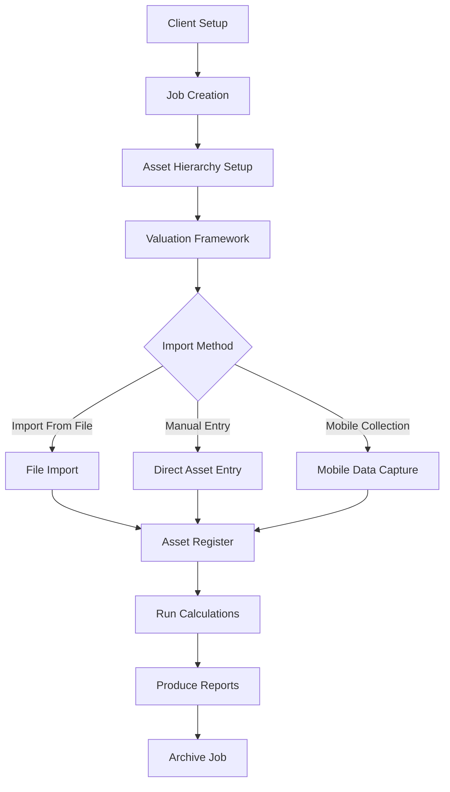

# 📋 Asset Valuer Pro Valuation Process Workflow

## 📋 Overview
This document outlines the technical implementation of the valuation process workflow in Asset Valuer Pro, mapping the business process described in the legacy documentation to the actual codebase components.

## 📋 Business Context
According to the legacy documentation, the Asset Valuer Pro valuation process consists of several key steps:

1. Set up a File (Client and Job)
2. Create Valuation Framework (asset hierarchy and assumptions)
3. Create and register Assets (usually by importing)
4. Collect Key Data (using mobile app or direct entry)
5. Import/Export Data (CSV files and images)
6. Run Calculations (refresh valuation data)
7. Finalize Valuation and Produce Reports
8. Undertake Post-Valuation Processes (archiving)

## 🏗️ Technical Process Flow



## 📋 Step 1: Client and Job Setup
### Business Process
- Create a 'client' and allocate a 'license type'
- Create 'Users' and assign 'Roles'
- Create a valuation 'Job' and specify effective date

### Technical Implementation
- `ClientController.cs` - Handles client creation and management
- `UserController.cs` - Manages user accounts and permissions
- `RoleController.cs` - Configures user roles and access rights
- `JobController.cs` - Creates and manages valuation jobs

### Key API Endpoints
- POST `/api/client` - Create new client
- POST `/api/job` - Create new valuation job
- GET `/api/client/{id}/jobs` - Get all jobs for a client

### Frontend Components
- `ClientEdit.tsx` - Client creation form
- `JobEdit.tsx` - Job creation and configuration form

## 📋 Step 2: Valuation Framework
### Business Process
- Create asset hierarchy (Asset Class, Type, Sub-Type)
- Define components hierarchy (Component Type, Sub-Type)
- Specify valuation assumptions at different levels

### Technical Implementation
- `AssetHierarchyController.cs` - Manages asset hierarchy
- `ComponentHierarchyController.cs` - Manages component hierarchy
- `AssumptionsController.cs` - Manages valuation assumptions
- `ValuationProfileController.cs` - Manages valuation profiles

### Key Database Entities
- `HierarchyNode` - Represents nodes in asset/component hierarchy
- `ValuationProfile` - Defines how assets are valued
- `ValuationProfileRule` - Maps profiles to asset types
- `AssetAssumptions` - Stores valuation assumptions

### Frontend Components
- `UpdateHierarchy.tsx` - UI for hierarchy management
- `HierarchyNavigation.tsx` - Navigation for hierarchy tree
- `ValuationProfileEdit.tsx` - Valuation profile editor

## 📋 Step 3: Asset Registration
### Business Process
- Import asset register from client data
- Register assets manually if needed
- Link assets to hierarchy and assumptions

### Technical Implementation
- `ImportController.cs` - Handles bulk asset import
- `AssetController.cs` - Manages individual assets
- `AssetHierarchyController.cs` - Links assets to hierarchy

### Key API Endpoints
- POST `/api/import/assets` - Import assets from CSV/Excel
- POST `/api/asset` - Create single asset
- GET `/api/asset` - Retrieve assets with filtering

### Key Processing Logic
- `ImportAssetRegisterSpreadsheetCommand.cs` - Processes asset imports
- `AssetFileValidator.cs` - Validates import data format

## 📋 Step 4: Data Collection
### Business Process
- Collect field data using mobile app
- Update asset information in the system
- Add photographs and documents

### Technical Implementation
- iOS mobile application for field data collection
- `ContentController.cs` - Manages photos, notes, and documents
- `DocumentController.cs` - Handles document uploads

### Data Exchange Format
- CSV files for export/import to mobile app
- ZIP files for images and documents
- `ImportController.cs` handles the data synchronization

## 📋 Step 5: Run Calculations
### Business Process
- Refresh calculations to apply assumptions
- Update asset valuations based on collected data
- Generate valuation results

### Technical Implementation
- `AssetController.cs` - `/api/asset/recalculate` endpoint
- `ValuationService.cs` - Core calculation logic
- Domain entities for different valuation methods:
  - `DirectCostValuationMethod.cs`
  - `ApportionmentValuationMethod.cs`
  - `IncomeApproachValuationMethod.cs`
  - `MarketApproachValuationMethod.cs`

### Key Calculation Methods
```csharp
// Simplified calculation flow
public decimal CalculateValue() {
  switch(ValuationType) {
    case "Direct Cost":
      return CalculateDirectCostValue();
    case "Apportionment":
      return CalculateApportionmentValue();
    case "Income":
      return CalculateIncomeValue();
    case "Market":
      return CalculateMarketValue();
    default:
      return 0;
  }
}
```

## 📋 Step 6: Report Generation
### Business Process
- Run validations to ensure data quality
- Produce financial reporting valuation reports
- Generate insurance valuation reports
- Create asset management reports

### Technical Implementation
- `ReportsController.cs` - Handles report generation requests
- `GetGeneralValuationReportsQuery.cs` - Financial reporting
- `GetInsuranceValuationReportsQuery.cs` - Insurance valuation
- `GetRenewalCostReportQuery.cs` - Asset management
- `ReportCalculationService.cs` - Core reporting calculations

### Key Report Types
- Financial Reporting: General Valuation, Movements Reconciliation
- Insurance: Full Replacement, Indemnity
- Asset Management: EasySAM, Renewals, Distribution by Score

## 📋 Step 7: Job Archiving
### Business Process
- Change job status to 'archived'
- Record final figures for future reference
- Prepare for next valuation cycle

### Technical Implementation
- `JobController.cs` - `/api/job/{id}/archive` endpoint
- Status transitions: "Open" -> "Draft" -> "Finalised" -> "Archived"
- Archive process copies current values to previous values for next cycle

### Archive Processing
```csharp
// Simplified archiving logic
public async Task<Unit> ArchiveJob(int jobId) {
  var job = await _context.Jobs.FindAsync(jobId);
  job.Status = JobStatus.Archived;
  
  var assets = await _context.Assets
    .Where(a => a.JobId == jobId)
    .ToListAsync();
    
  foreach (var asset in assets) {
    asset.PreviousGross = asset.Gross;
    asset.PreviousCurrentValue = asset.CurrentValue;
    asset.PreviousDepreciationExpense = asset.DepreciationExpense;
  }
  
  await _context.SaveChangesAsync();
  return Unit.Value;
}
```

## 📊 Integration Points

The valuation workflow integrates with several system components:

### Mobile Data Collection
Field data capture through iOS app integrates with:
- `ContentController.cs` - For uploading photos
- `ImportController.cs` - For syncing asset data

### External Systems
- Client asset management systems can export data for import
- Financial systems can consume valuation reports

### Document Generation
- Reports from `ReportsController.cs` are used for:
  - Financial statement preparation
  - Insurance renewals
  - Asset management planning

## 📝 Workflow Considerations

> **⚠️ Version Note:**  
> The legacy documentation describes a File Maker Pro app for mobile data collection, while the repository contains a React Native iOS app. Similarly, the documentation mentions Excel-based data exchange while the code implements API-based exchanges. This suggests the version 3 transition mentioned in legacy documentation is underway or completed.

### Version Differences
- Version 2: File Maker Pro used for mobile data collection
- Version 3: Custom iOS app for data collection
- Version 2: Excel export/import for data exchange
- Version 3: API-based data exchange

### Performance Considerations
- Large asset registers can have performance impacts on calculation
- Calculation refresh is resource-intensive for large datasets
- Report generation for extensive asset portfolios may require optimization

### Business Process Variations
Different valuation approaches follow slightly different workflows:
- Direct Cost: Component-level valuation
- Apportionment: Asset-level valuation with apportionment
- Market: Based on comparable property sales
- Income: Based on income-generating potential

## 📋 Technical Decision Points

### When to Use Each Valuation Method
- **Direct Cost**: Used for specialized assets where component costs can be clearly identified
- **Apportionment**: Used for infrastructure and assets where component-level detail is impractical
- **Market**: Used for land and buildings with an active market
- **Income**: Used for income-generating properties

### Validation Requirements
Before calculations can be run, the system requires:
- Complete asset hierarchy
- Appropriate valuation profiles
- Required asset attributes (dimensions, condition scores)
- Component details (for Direct Cost method)

### Calculation Logic
The calculation sequence follows this order:
1. Apply assumption values from hierarchy
2. Calculate replacement costs
3. Apply condition-based adjustments (from valuation profiles)
4. Calculate depreciation (based on useful life, RUL, and depreciation method)
5. Calculate insurance values (if applicable)

## 📝 Business Value

The valuation workflow delivers significant business value by:

1. **Standardization**: Ensuring consistent valuation methodology across different asset types
2. **Compliance**: Meeting IFRS/IPSAS financial reporting requirements
3. **Efficiency**: Automating complex valuation calculations
4. **Accuracy**: Reducing human error in valuation processes
5. **Auditability**: Providing clear documentation of valuation inputs and methods
6. **Decision Support**: Generating reports to inform asset management decisions

## 📋 Common Challenges and Solutions

| Challenge | Technical Solution |
|-----------|-------------------|
| Data Quality Issues | Validation in `AssetFileValidator.cs` and UI validation |
| Calculation Performance | Optimized database queries and selective recalculation |
| Complex Hierarchy Setup | Hierarchy templates and import/export functionality |
| Version Control | Job status tracking and archiving process |
| Mobile Connectivity | Offline capability in mobile app with sync on connection |
| Report Generation Time | Background processing for large reports |

## 📋 Related Documentation

- [Mobile Data Collection](../Mobile_Data_Collection.md) - Details on field data collection
- [Report Business-Technical Map](../Report_Business_Technical_Map.md) - Mapping of reports to business needs
- Asset model documentation: [Asset.md](../Models/Asset.md)
- Component model documentation: [Component.md](../Models/Component.md)
- Job model documentation: [Job.md](../Models/Job.md)
